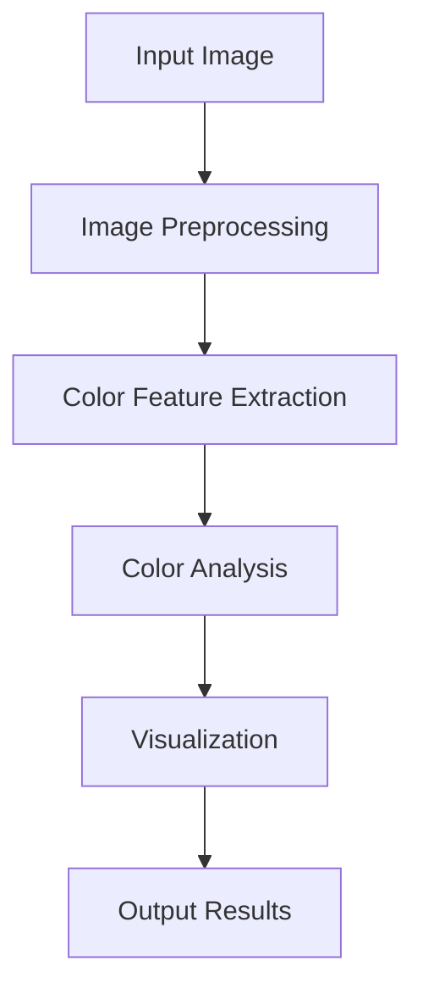
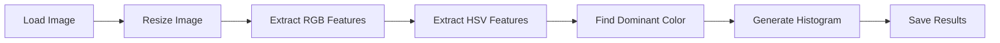
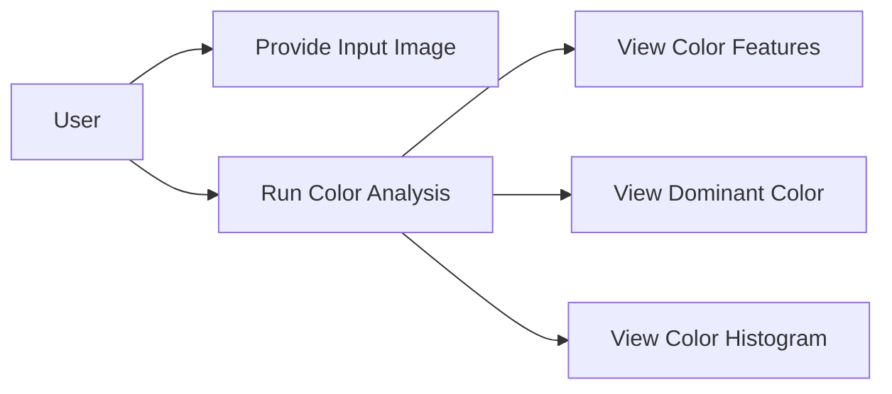
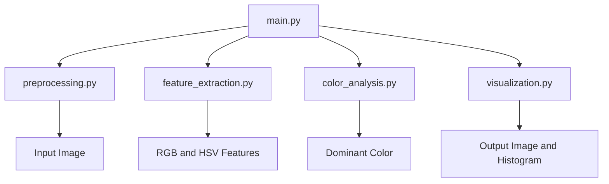
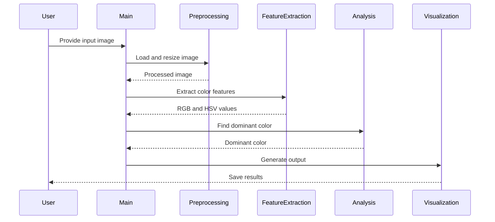

# ColorVision – Image Color Feature Extraction and Analysis

## About the Project

ColorVision is a simple Computer Vision project made using Python. The main purpose of this project is to take an image and find useful information about its colors.

The program reads an image, resizes it, calculates its RGB and HSV color values, finds the dominant color, and creates a color histogram.

## Objectives

The main objectives of this project are:

* To load and preprocess an image.
* To extract RGB color features.
* To extract HSV color features.
* To find the dominant color in an image.
* To generate a color histogram.
* To save the processed results.

## Main Features

The project has the following features:

1. Image loading and resizing
2. RGB feature extraction
3. HSV feature extraction
4. Dominant color detection
5. Color histogram generation
6. Output image generation
7. Basic testing of the feature extraction functions

## Technologies Used

* Python
* OpenCV
* NumPy
* Matplotlib

## Project Structure

```text
ColourVision/
│
├── README.md
├── statement.md
├── requirements.txt
│
├── src/
│   ├── main.py
│   ├── preprocessing.py
│   ├── feature_extraction.py
│   ├── color_analysis.py
│   └── visualization.py
│
├── data/
│   └── input.jpg
│
├── results/
│   ├── output.jpg
│   └── color_histogram.png
│
└── tests/
    └── test_features.py
```

## How the Project Works

The project follows a simple sequence:

**Input Image → Preprocessing → Feature Extraction → Color Analysis → Visualization**

First, the image is loaded from the `data` folder and resized.

Then the program calculates the average Red, Green and Blue values. It also converts the image into HSV format and calculates the average Hue, Saturation and Value.

After that, the program compares the average RGB values and finds which color has the highest value.

Finally, the program creates a color histogram and saves the output files in the `results` folder.

## Installation

Open the project folder in VS Code and install the required libraries:

```bash
python -m pip install -r requirements.txt
```

## How to Run

Put the input image in:

```text
data/input.jpg
```

Then run:

```bash
python src/main.py
```

The results will be saved in the `results` folder.

## Testing

The project also contains a simple test file.

Run:

```bash
python tests/test_features.py
```

If everything works correctly, it displays:

```text
All tests passed successfully!
```

## Functional Modules

### 1. Preprocessing Module

This module loads the image and resizes it before further processing.

### 2. Feature Extraction Module

This module calculates the average RGB and HSV values and also calculates the color histogram.

### 3. Color Analysis Module

This module uses the extracted RGB values to find the dominant color.

### 4. Visualization Module

This module saves the processed image and generates the color histogram.

## Non-Functional Requirements

* The program should be easy to run.
* The program should process an image in a short time.
* The program should show an error if the input image cannot be loaded.
* The code should be divided into separate modules.
* The project should be easy to modify and extend.
* The project should work on a system with Python and the required libraries installed.

## Future Improvements

In the future, the project can be improved by:

* Detecting more than one dominant color.
* Adding more color spaces such as LAB.
* Adding a simple graphical interface.
* Allowing multiple images to be processed at once.
* Adding more image features such as texture and shape.

## Conclusion

This project helped in implementing basic Computer Vision concepts such as image preprocessing, color feature extraction, color analysis and histogram visualization. OpenCV was used for image processing, while NumPy and Matplotlib were used for calculations and visualization.

## System Architecture



## Workflow



## Use Case Diagram



## Component Diagram



## Sequence Diagram



